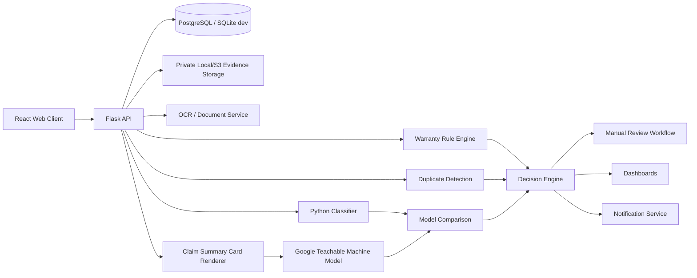
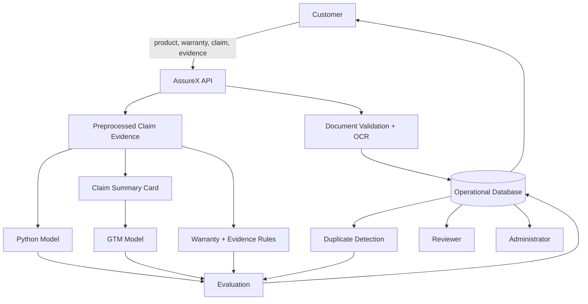
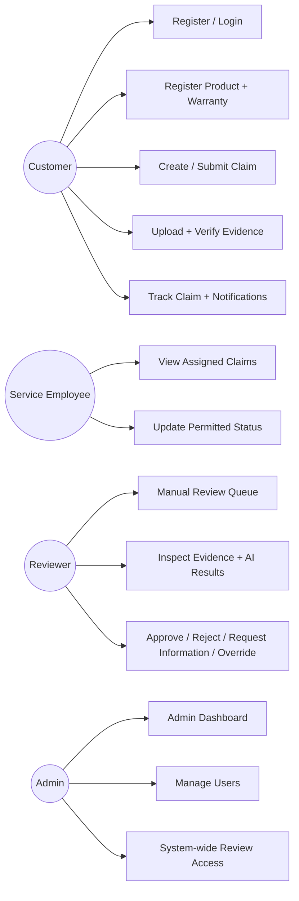
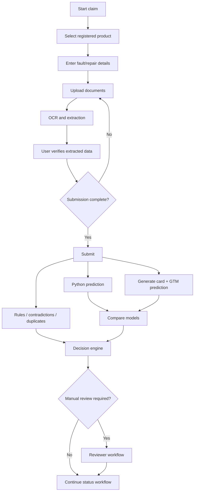
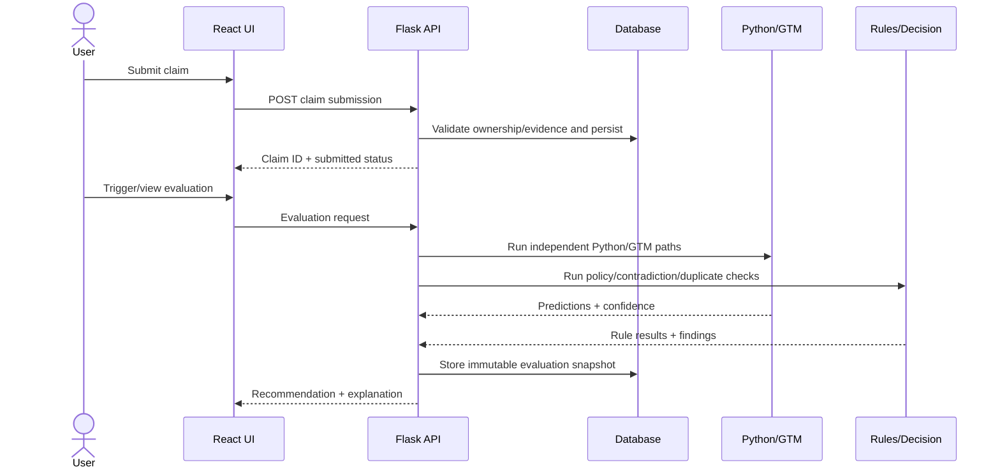
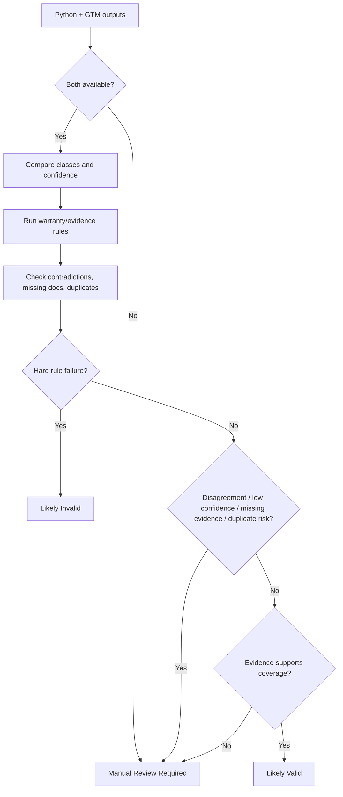

# AssureX Claim Engine Project Report

**Project:** AssureX Claim Engine  
**Theme:** AI-Powered Document Ops  
**Category:** NextWave AI and ML  
**Repository:** `AIENGINEERS-SYS/AssureX-claims`  
**Report version:** 1.0  
**Prepared from repository state:** 2026-09-28

> This report documents the implementation that is actually present in the repository. Where a required deliverable is incomplete, the limitation is stated rather than replaced with invented evidence.

## 1. Problem definition

Warranty claims are often evaluated by manually checking purchase information, product age, fault descriptions, repair history, warranty conditions, serial numbers, supporting documents, exclusions, and prior claims. That process is slow and can produce inconsistent decisions, missed exclusions, duplicate claims, overlooked contradictions, and delayed customer service.

AssureX addresses this by combining secure claim intake, document processing, structured warranty rules, duplicate detection, two independent machine-learning paths, model-confidence comparison, and human review.

## 2. Background and business necessity

Manufacturers, retailers, service centres, and warranty administrators need a repeatable way to determine whether a claim is likely valid, likely invalid, or too uncertain for automation. A useful claims platform must do more than run a classifier. It also needs to preserve evidence, enforce ownership, detect contradictions, retain audit history, and route uncertain cases to people.

The project therefore treats machine-learning output as evidence rather than authority. Warranty rules and document checks can support or challenge the model outputs, and reviewer decisions are stored separately from automated recommendations.

## 3. Proposed solution

AssureX is a React and Flask Web application backed by SQLAlchemy and a relational database. It provides:

- registration, authentication, persisted JWT sessions, and role-based access;
- product and warranty registration;
- multi-step claim drafting and submission;
- private evidence upload and OCR review;
- SHA-256 duplicate-document detection;
- Python classification;
- Claim Summary Card generation;
- Google Teachable Machine classification;
- confidence comparison;
- configurable warranty-rule evaluation;
- contradiction and missing-document detection;
- duplicate-claim scoring;
- final automated recommendation;
- manual-review and override workflows;
- role-aware dashboards;
- notifications and warranty-expiry reminders;
- audit history and model-version tracking.

## 4. Purpose

The application is intended to reduce repetitive manual work while preserving human control over uncertain, conflicting, incomplete, or high-risk warranty claims. It also provides demonstrable evidence for how each decision was reached.

## 5. Scope

### Included

- customer, employee, reviewer, and administrator roles;
- products and warranties;
- receipts, invoices, warranty cards, images, serial evidence, fault evidence, diagnostics, and repair reports;
- OCR extraction and user confirmation;
- claim workflow and status tracking;
- Python and GTM model inference;
- structured policy/rule evaluation;
- missing-document, contradiction, serial, and duplicate checks;
- manual review;
- dashboards and notifications;
- testing, migrations, deployment configuration, and documentation.

### Out of scope or incomplete in the current repository

- live manufacturer ERP/warranty-database integration;
- payment processing;
- automatic external email/SMS/push delivery;
- production malware scanning of uploaded evidence;
- a fully implemented downloadable claim-report/export API and report-centre UI;
- a committed 30-claim paired Python/GTM unseen-test comparison artifact.

## 6. Assumptions

1. Submitted claim details and documents can be incomplete or inaccurate.
2. Reviewers remain responsible for final human adjudication where the evidence is uncertain.
3. Model confidence is not a fraud probability.
4. Model artifacts and policy versions can change over time, so historical predictions must retain version references.
5. Production deployment uses PostgreSQL and a shared Redis rate-limit store.
6. Customer evidence is stored privately and is never intended to be a public static asset.
7. Policy configuration is application logic, not legal advice.

## 7. Constraints

- model quality depends on dataset quality, balance, and representativeness;
- OCR accuracy depends on scan quality;
- Python and GTM outputs can disagree because they are independently trained;
- warranty rules differ between categories and may change;
- privacy/security controls are required because the system stores personal, purchase, warranty, and evidence data;
- the GTM runtime requires a compatible TensorFlow/TensorFlowJS environment;
- the current project does not yet contain a complete report/export implementation.

## 8. Functional requirements implementation summary

| Area | Repository implementation |
| --- | --- |
| Authentication/RBAC | Flask-JWT-Extended, persisted sessions, token rotation/revocation, role checks |
| Profiles | customer account/profile APIs |
| Products | product registration, uniqueness and date/price validation |
| Warranties | standard/extended records, calculated expiry/status |
| Claim intake | drafts, autosave, 4-step wizard, validated submission |
| Evidence | private PDF/JPG/JPEG/PNG upload, signature/MIME/size checks |
| OCR | text-first PDF path, Tesseract image/scanned path, reviewed extracted data |
| Data validation | Marshmallow schemas, database constraints, upload validation |
| Python model | XGBoost artifact and prediction service |
| Claim Summary Card | deterministic 224x224 evidence card |
| GTM | exported TensorFlowJS model and GTM prediction adapter |
| Comparison | Strong/Acceptable/Weak/Disagreement/Uncertain statuses |
| Policy rules | expiry, serial, contradictions, missing evidence, repair authorization, exclusions |
| Duplicate detection | document hash + claim similarity signals |
| Manual review | reviewer queue, notes, approve/reject/request information, overrides |
| Status tracking | draft through closed states |
| Notifications | in-app event-driven notifications and warranty reminders |
| Dashboards | customer, reviewer and administrator views |
| Reports/exports | deliverable documentation added here; downloadable report/export feature still incomplete |

## 9. Non-functional requirements

### Performance

The application avoids loading model artifacts until prediction is requested, uses indexed database lookups, paginates list APIs, and uses React Query caching for dashboard reads. The SRS target of dual prediction within five seconds must still be validated in the final deployed environment using representative hardware and model artifacts.

### Scalability

Production configuration requires PostgreSQL. The schema includes indexes for ownership, claim state, review queues, predictions, notifications, duplicate hashes, and model history. This supports the SRS goal of handling at least 10,000 claims, but a dedicated production load test is still required before claiming capacity.

### Usability

React provides separate customer, reviewer, and administrator flows, a guided claim wizard, OCR review screens, dashboard views, notifications, and mobile-responsive layouts.

### Accuracy

The committed Python test evidence reports 92.5% test accuracy. GTM unseen-test accuracy evidence is not currently committed in a comparable evaluation file, so the SRS requirement that both models reach at least 85% cannot yet be verified from repository evidence alone.

### Availability

Railway deployment files are present. The SRS 99% business-hours availability target is an operational target and requires monitoring from an actual deployed service.

## 10. Application architecture



## 11. Module descriptions

### Backend

- `backend/api/`: authenticated HTTP routes and schemas.
- `backend/services/claim_submission.py`: claim drafting/submission and ownership checks.
- `backend/services/document_service.py`: upload/OCR lifecycle and confirmed extraction.
- `backend/services/predictions.py`: Python/GTM inference adapters and normalization.
- `backend/services/claim_card.py`: GTM card rendering.
- `backend/services/model_comparison.py`: class/confidence comparison.
- `backend/services/warranty_policy.py`: policy configuration loading.
- `backend/services/claim_rules.py`: warranty/evidence rule execution.
- `backend/services/duplicate_detection.py`: claim-level duplicate signals.
- `backend/services/decision_engine.py`: combined automated recommendation.
- `backend/services/notifications.py`: domain notifications and reminders.
- `backend/security.py`: JWT callbacks and role enforcement.
- `backend/middleware.py`: structured errors, CORS and security headers.

### Frontend

- `frontend/src/claims/`: claim wizard and evidence workflow.
- `frontend/src/products/`: product/warranty management.
- `frontend/src/dashboard/`: role-based dashboards and notification centre.

### Data and ML

- `data/`: structured dataset and policy research/configuration.
- `notebooks/`: preprocessing, training, evaluation and exported metrics.
- `models/`: saved Python model artifacts.
- `gtm_model/`: exported GTM model, weights and metadata.
- `dataset_generator/`: Claim Summary Card dataset generation.
- `policies/`: SRS policy deliverables.
- `reports/`: project, model and compliance reports.

## 12. Database design

The operational database stores users, products, warranties, claims, documents, repair history, model versions, Python predictions, GTM predictions, rule results, combined evaluations, reviews, notifications, duplicate investigations, and audit logs.

Important integrity choices include:

- separate public identifiers and internal integer primary keys;
- foreign-key relationships with restrictive delete behavior;
- model-version references on stored predictions;
- append-oriented evaluation/review/audit history;
- confidence constraints between 0 and 1;
- unique document hashes within a claim;
- indexed ownership/status/reviewer/date lookups.

## 13. High-level data dictionary

| Entity | Key information |
| --- | --- |
| User | identity, role, status, contact data, authentication version |
| Product | owner, name, category, brand, model, serial, purchase data |
| Warranty | product, provider, dates, coverage, exclusions, duration |
| Claim | owner, product/warranty, fault details, state, assignments, final recommendation |
| Document | claim/product/warranty link, type, MIME, hash, private path, OCR/review data |
| RepairHistory | product/claim, repair date, centre, authorization, cost/outcome |
| ModelVersion | type, model name, version, artifact, training dataset, metrics |
| PythonPrediction | claim, class, three probabilities, top confidence, model version |
| GTMPrediction | claim, class, probabilities, card path, model version |
| RuleResult | claim, rule code/category/result/severity/evidence/policy version |
| EvaluationResult | combined snapshot, comparison, duplicate finding, contradictions, recommendation |
| Review | reviewer action, notes, override evidence and prior decision |
| Notification | recipient, event type, priority, references and read state |
| AuditLog | actor, action, entity, before/after metadata, timestamp |

## 14. Data Flow Diagram



## 15. Use Case Diagram



## 16. Activity Diagram



## 17. Sequence Diagram



## 18. Decision Flow Diagram



## 19. Rule-engine design

The current `ClaimRuleEngine` returns structured results containing a rule code, name, category, result, severity, message and evidence.

Implemented checks are:

1. **Warranty expiry**: compares claim date with the policy duration and any registered warranty expiry.
2. **Serial verification**: compares registered and extracted evidence.
3. **Contradiction detection**: checks impossible date ordering and model/serial conflicts.
4. **Missing documents**: compares policy-required evidence with uploaded categories.
5. **Repair authorization**: evaluates authorized versus unauthorized service history.
6. **Excluded damage**: checks configured exclusion phrases against fault/damage evidence.

The policies in `policies/` add the complete configuration fields required by the SRS, including reporting period, covered faults, replacement conditions, grace period, and explicit hard-fail/warning/manual-review lists.

## 20. Python classification model design

The final Python model artifact is XGBoost. The repository also contains comparison evidence for Random Forest, Extra Trees and Logistic Regression, satisfying the requirement to compare at least three suitable algorithms.

The classifier produces three canonical classes:

- Likely Valid;
- Likely Invalid;
- Manual Review Required.

The runtime normalizes these into `valid`, `invalid`, and `manual_review`, and stores all three class probabilities plus the top confidence and model version.

## 21. Google Teachable Machine design

The repository contains an exported TensorFlowJS Teachable Machine image classifier under `gtm_model/`.

Committed metadata identifies three labels:

- `valid_ claim`;
- `invalid_claim`;
- `manual_review`.

The GTM input is a deterministic 224x224 Claim Summary Card generated from claim evidence. The runtime normalizes GTM labels into the same canonical classes used by the Python model.

The card deliberately excludes the Python prediction, Python confidence, and final application decision so the GTM path remains independent.

## 22. Dataset description and generation

The repository contains a Nigerian warranty-claim dataset under `data/`, supporting three outcome classes and fields describing product, warranty, fault, evidence, repair and policy context.

`dataset_generator/claim_card_generator.py` converts structured claims into labelled Claim Summary Card images. Training images can receive multiple visual variants while validation/test images remain single representations.

### Current compliance note

The SRS requires a 70% / 15% / 15% train-validation-test split. The current generator hashes records into an 80% / 10% / 10% split. This should be corrected before final competition submission.

## 23. Preprocessing and feature engineering

The project model pipeline uses structured numeric/categorical inputs and includes derived evidence such as:

- fault-to-claim delay;
- reporting delay;
- warranty months;
- document completeness;
- policy reporting deadline;
- product category;
- fault category;
- damage cause;
- authorization of prior repair;
- serial/IMEI availability.

The committed feature-importance export shows important signals including misuse, IMEI tampering, manufacturing defect, fault-to-claim delay, unauthorized repair, liquid damage, product category and policy reporting deadline.

## 24. Python model training procedure

The notebooks compare multiple classifiers using cross-validation and validation metrics. The committed comparison table reports:

| Model | CV accuracy | CV macro F1 | Validation accuracy | Validation macro F1 |
| --- | ---: | ---: | ---: | ---: |
| XGBoost | 0.9250 | 0.9244 | 0.9472 | 0.9468 |
| Random Forest | 0.9048 | 0.9043 | 0.9194 | 0.9192 |
| Extra Trees | 0.8679 | 0.8678 | 0.9000 | 0.8990 |
| Logistic Regression | 0.8470 | 0.8465 | 0.8806 | 0.8813 |

XGBoost was selected as the final model.

## 25. Google Teachable Machine training procedure

The project includes a GTM model export and Claim Summary Card generation tooling. Final competition evidence should additionally include:

- training configuration;
- image counts per class;
- screenshots of the three classes;
- training observations;
- misclassified examples;
- retraining details;
- validation/test screenshots.

Those items are not all currently represented as structured repository evidence.

## 26. Model evaluation

### Python test metrics

The committed classification report contains 360 test records, 120 per class.

| Class | Precision | Recall | F1 | Support |
| --- | ---: | ---: | ---: | ---: |
| Likely Invalid | 0.9640 | 0.8917 | 0.9264 | 120 |
| Likely Valid | 0.8824 | 1.0000 | 0.9375 | 120 |
| Manual Review Required | 0.9381 | 0.8833 | 0.9099 | 120 |
| **Overall accuracy** |  |  | **0.9250** | **360** |
| **Macro average** | **0.9281** | **0.9250** | **0.9246** | **360** |

### Confusion matrix

| Actual \ Predicted | Likely Invalid | Likely Valid | Manual Review Required |
| --- | ---: | ---: | ---: |
| Likely Invalid | 107 | 6 | 7 |
| Likely Valid | 0 | 120 | 0 |
| Manual Review Required | 4 | 10 | 106 |

## 27. Model prediction and confidence comparison

`ModelComparisonService` calculates:

```text
confidence_difference =
abs(python_top_confidence - gtm_top_confidence)
```

It classifies the pair as:

- Strong Match;
- Acceptable Match;
- Weak Match;
- Model Disagreement; or
- Uncertain Result.

Thresholds are environment-backed rather than hard-coded into individual routes.

A separate comparison report is included in `reports/model_prediction_confidence_comparison_report.md`. The repository currently has Python unseen-test predictions but does not contain a committed 30-record GTM unseen-test result file, so the required 30 paired comparisons remain an explicit final-submission gap.

## 28. Testing strategy

The test suite covers:

- authentication and RBAC;
- migrations and database integrity;
- products and warranties;
- claim submission;
- secure evidence uploads;
- OCR processing;
- model/evaluation behavior;
- fuzzy rule scenarios;
- contradiction detection;
- duplicate detection;
- security boundaries;
- notifications;
- dashboards;
- browser-level claim/product flows.

CI compiles Python, applies migrations, executes the backend tests, and builds the frontend.

## 29. Security considerations

Implemented controls include:

- password hashing with Bcrypt;
- short-lived JWT access tokens and rotating refresh tokens;
- persisted session revocation;
- role-based and ownership checks;
- generic 404/authorization behavior for cross-user resources;
- private document storage;
- extension/MIME/signature validation;
- SHA-256 duplicate hashing;
- rejection of unsafe/encrypted/active-content PDF cases;
- no-store response caching;
- CORS allowlisting;
- CSP, frame, MIME and referrer headers;
- HSTS in production;
- Redis-backed production rate limiting;
- structured errors without stack traces or storage paths;
- audit records for important mutations.

## 30. Privacy considerations

Customer evidence and OCR text can contain personal and purchase information. The application avoids placing private storage paths/hashes in user responses, stores model cards privately, scopes records by role/ownership, and does not use uploaded operational data as training data automatically.

Production deployment still requires an explicit retention/deletion policy, database least privilege, secure backups and applicable Nigerian data-protection compliance review.

## 31. Limitations

1. Downloadable claim-report and CSV/Excel export APIs are not yet implemented.
2. The repository does not yet contain a complete 30-claim paired GTM/Python unseen-test report.
3. GTM accuracy on unseen test cards cannot be verified from the committed evidence alone.
4. The Claim Summary Card dataset generator currently uses 80/10/10 rather than the SRS-required 70/15/15 split.
5. OCR quality depends on document quality and installed language/runtime support.
6. Policy text is application configuration, not a substitute for a manufacturer's actual legal warranty.
7. The rule engine currently supports a core subset of the richer policy fields now documented in `policies/`.
8. Availability, performance-at-scale and 10,000-claim capacity require deployment/load-test evidence.

## 32. Future enhancements

- implement the access-controlled PDF/CSV/XLSX report centre;
- generate and commit the 30+ paired unseen-test comparison report;
- correct the dataset card split to 70/15/15;
- add richer policy-rule execution for reporting deadlines, covered-fault allowlists, replacement conditions and grace periods;
- add email/SMS/push notification channels through a queued outbox;
- add malware scanning/quarantine for uploads;
- add load/performance testing and deployment observability;
- add model-drift and calibration monitoring;
- add formal data-retention and privacy-management workflows.

## 33. Conclusion

AssureX already implements the central competition workflow: secure intake, evidence review, dual-model prediction, confidence comparison, configurable rules, contradictions, duplicate detection, manual review, dashboards, notifications and auditability. The strongest committed model evidence is the Python classifier, which reaches 92.5% test accuracy on 360 balanced test observations.

The remaining submission work is primarily evidence and reporting completion rather than invention of a new claims architecture: paired GTM unseen-test results, a corrected dataset split, and downloadable report/export functionality.
